# ✈️ British Airways — Customer Booking Prediction

<div align="center">


**End-to-end machine learning project predicting whether a British Airways customer will complete a flight booking**

*British Airways Data Science Virtual Experience Programme · Forage*

[🚀 Live App](#-run-locally) · [📊 Results](#-model-results) · [🔍 Findings](#-key-findings) · [📁 Project Structure](#-project-structure)

</div>

---

## 📌 Project Overview

British Airways loses potential customers every day to incomplete bookings. This project builds a **Random Forest classifier** trained on 50,000 historical booking records to predict — *before a customer completes their purchase* — whether they are likely to book. This enables proactive, data-driven marketing to re-engage high-probability customers at the right moment.

| | |
|---|---|
| **Dataset** | 50,000 British Airways customer bookings |
| **Target** | `booking_complete` (binary: 0 = Not completed, 1 = Completed) |
| **Algorithm** | Random Forest Classifier (200 trees) |
| **Evaluation** | 5-Fold Stratified Cross-Validation |
| **Deliverable** | Trained model + Interactive Streamlit web application |

---

## 📊 Model Results

<div align="center">

| Metric | Score (5-Fold CV) |
|:------:|:-----------------:|
| **Accuracy** | **73.1%** |
| **ROC-AUC** | **0.772** |
| Precision | 0.311 |
| **Recall** | **65.9%** |
| F1 Score | 0.423 |

> 🎯 The model correctly identifies **65.9% of genuine bookers** — enabling targeted proactive marketing at scale.

</div>

---

## 🔍 Key Findings

### 1. Severe Class Imbalance — Only 15% Complete Their Booking

The dataset is heavily imbalanced: 85% of customers do not complete a booking. This required special handling via `class_weight='balanced'` in the model.

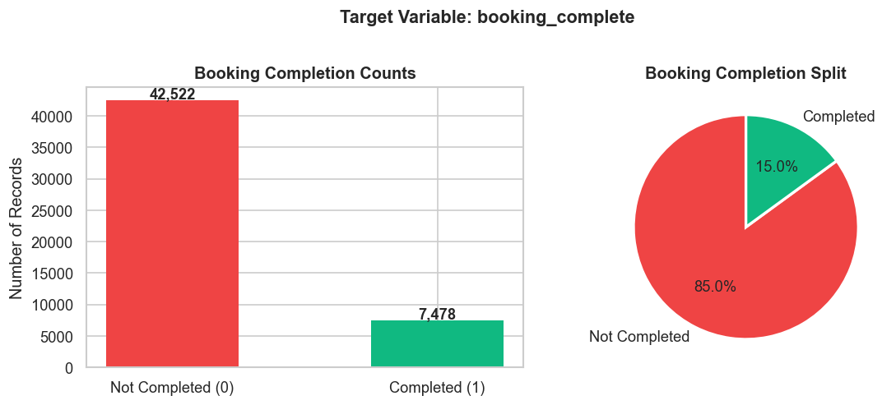

---

### 2. Numeric Feature Distributions

Purchase lead time is heavily right-skewed (mean = 84.9 days), meaning most customers book close to their travel date with a long tail of advance planners. Flight duration shows a bimodal pattern reflecting short-haul vs long-haul routes.

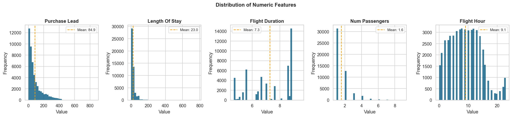

---

### 3. Internet Channel & Round Trips Have Higher Completion Rates

Internet bookings (15.5%) outperform Mobile (10.8%). Round trips (15.1%) significantly outperform OneWay (5.2%) and CircleTrip (4.3%) — customers planning return journeys show stronger commitment.

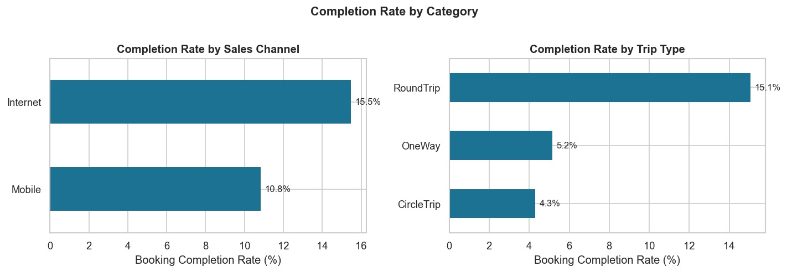

---

### 4. Flight Day Has Minimal Impact on Completion Rate

Wednesday has the highest completion rate (16.3%) but the variation across days is small (~2%). Day of week is a weak predictor — more useful as a control variable than a primary signal.

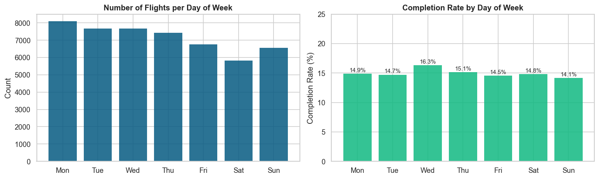

---

### 5. Purchase Lead & Length of Stay — Distributions Similar Across Classes

Box plots show that completed and non-completed bookings have overlapping distributions for both purchase lead and length of stay. These features contribute as part of a combination rather than standalone predictors.

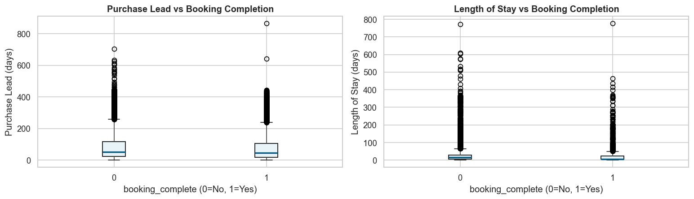

---

### 6. Add-On Selections Signal Higher Booking Intent

Customers who select add-ons show notably higher completion rates. Preferred Seat selectors complete at 17.7% vs 13.8% for those who don't. This validates add-on selections as commitment signals.

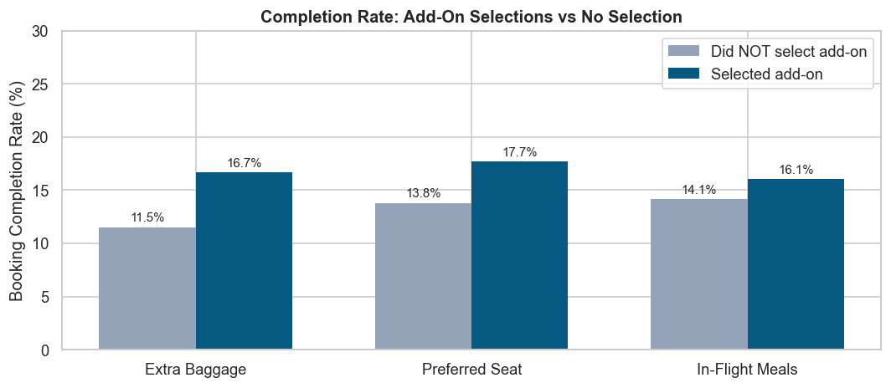

---

### 7. Correlation Matrix — No Multicollinearity Issues

No strong correlations between input features, confirming the feature set is diverse and non-redundant. The highest correlation (0.32) is between `wants_preferred_seat` and `wants_in_flight_meals` — both add-on behaviours.

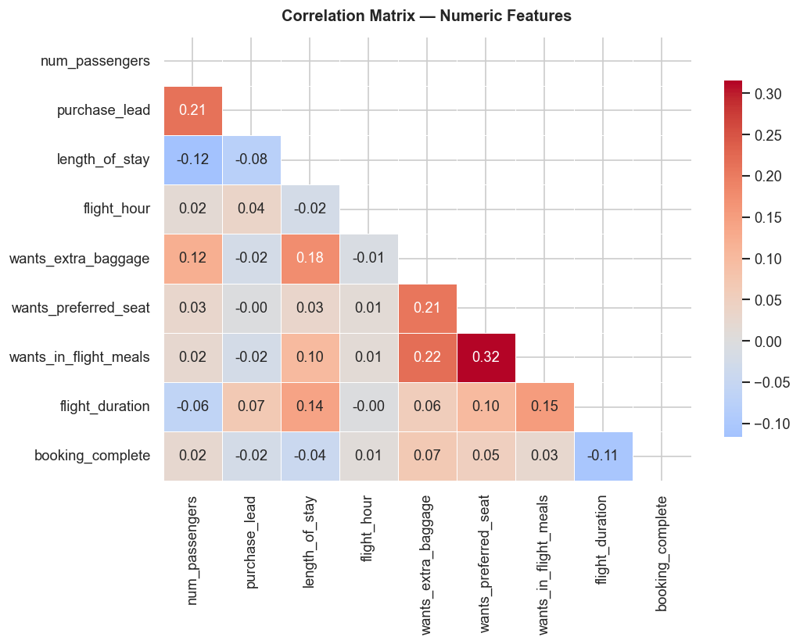

---

### 8. Engineered Features Validate Business Intuition

Four new features were created. Short-haul flights (18.1%) show higher completion rates than long-haul (13.8%). Last-minute bookers (17.1%) paradoxically complete at higher rates than advance planners (13.8%).

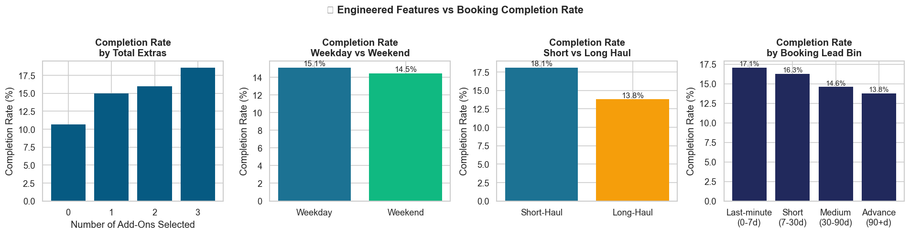

---

## 🤖 Model Evaluation

### Cross-Validation Performance

5-fold stratified cross-validation shows stable scores across all folds, confirming the model generalises well and isn't overfitting to any particular data split.

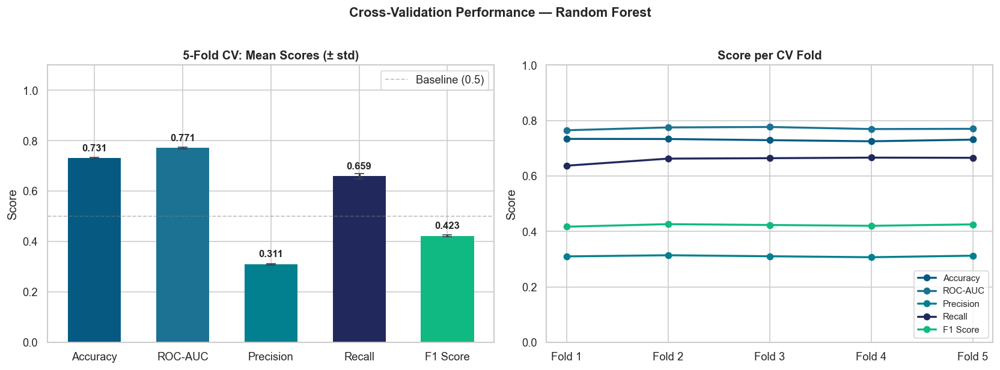

---

### ROC Curve & Confusion Matrix

The ROC-AUC of **0.859** on the full dataset demonstrates strong discriminative ability. The confusion matrix shows the trade-off: high recall (correctly catching real bookers) at the cost of some false positives.

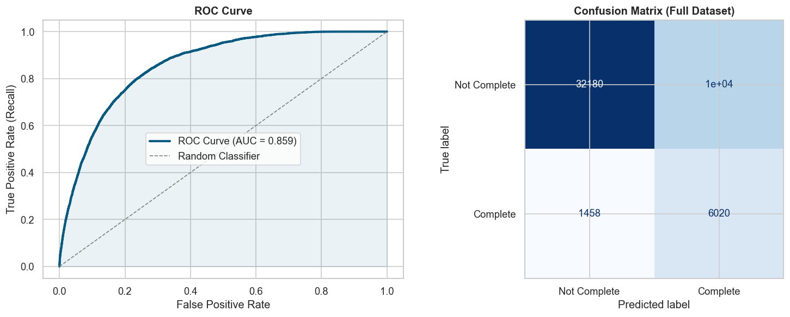

---

## 📈 Feature Importance

### All Feature Importances

**Booking Origin** dominates with 33.3% importance — where a customer books from is the single strongest predictor of completion. Route (14.5%) reinforces the geographic signal. Together they explain ~48% of the model's total predictive power.


---

### Top 10 Most Important Features

The top 6 features alone explain **80% of predictive power** — a highly parsimonious model. Geographic features (Origin + Route) and trip characteristics (Length of Stay, Flight Duration) dominate.

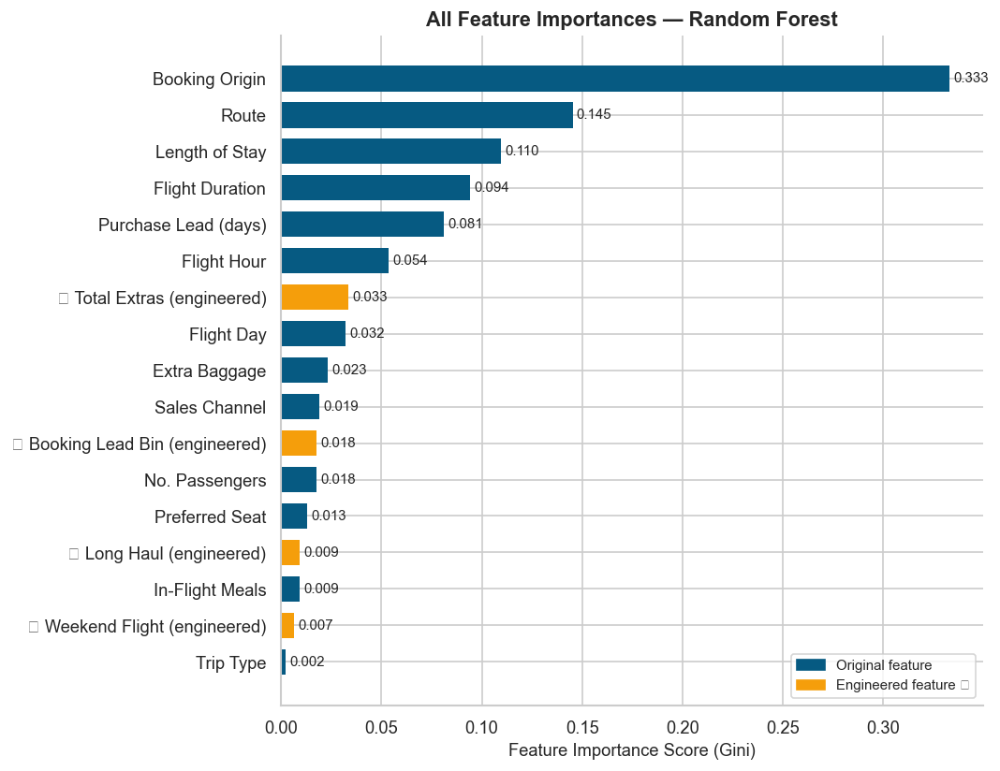

---

### Cumulative Feature Importance

Just **6 features** capture 80% of the model's importance. **12 features** reach 95%. This means a simplified 6-feature model could be deployed in production with minimal performance loss.

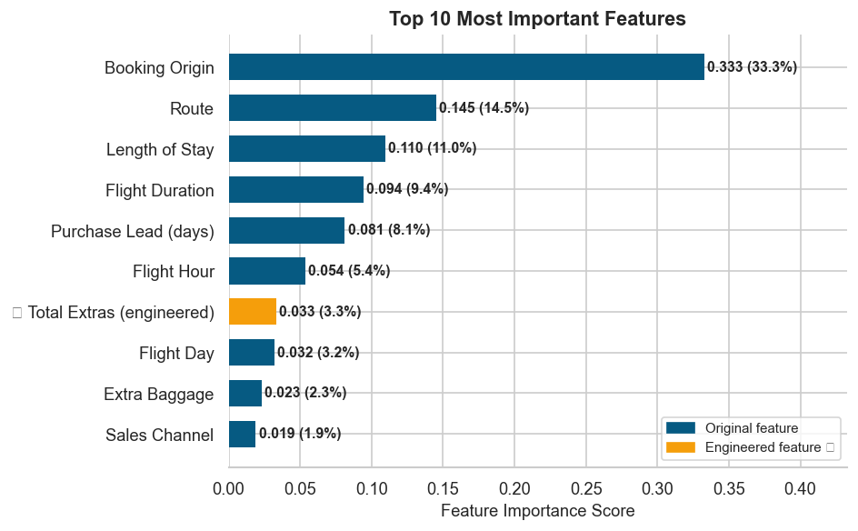

---

## 🎯 Summary Dashboard

Full project summary showing model performance metrics, top 5 predictors, and the clear business insight that customers selecting more add-ons have progressively higher completion rates (10.7% → 18.6%).

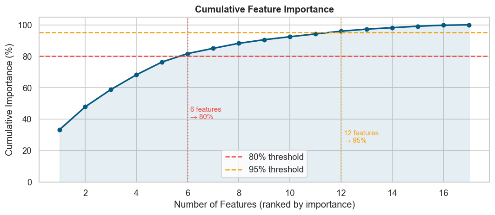

---

## 🛠️ Tech Stack

| Category | Tools |
|---|---|
| **Language** | Python 3.10+ |
| **ML Framework** | scikit-learn (RandomForestClassifier, StratifiedKFold, cross_validate) |
| **Data** | pandas, numpy |
| **Visualisation** | matplotlib, seaborn |
| **Web App** | Streamlit |
| **Notebook** | Jupyter |

---

## 📁 Project Structure

```
british-airways-booking-prediction/
│
├── 📓 BA_Task2_Customer_Booking_Prediction.ipynb   # Full analysis notebook
├── 🖥️  app.py                                      # Streamlit web application
├── 📋 requirements.txt                             # Python dependencies
├── 📊 customer_booking.csv                         # Dataset (50,000 records)
│
├── 📁 images/                                      # All output charts
│   ├── output.png                                  # Target variable distribution
│   ├── output_1.png                                # Numeric feature histograms
│   ├── output_2.png                                # Completion rate by category
│   ├── output-3.png                                # Flight day analysis
│   ├── output-5.png                                # Box plots
│   ├── output-6.png                                # Add-on selections chart
│   ├── output-7.png                                # Correlation heatmap
│   ├── output-8.png                                # Engineered features
│   ├── output-9.png                                # CV performance
│   ├── output-10.png                               # ROC + Confusion matrix
│   ├── output-11.png                               # All feature importances
│   ├── output-12.png                               # Top 10 features
│   ├── output-13.png                               # Cumulative importance
│   └── output-14.png                               # Summary dashboard
│
└── 📄 README.md
```

---

## 🚀 Run Locally

### 1. Clone the repository
```bash
git clone https://github.com/YOURUSERNAME/british-airways-booking-prediction.git
cd british-airways-booking-prediction
```

### 2. Install dependencies
```bash
pip install -r requirements.txt
```

### 3. Launch the Streamlit app
```bash
streamlit run app.py
```

### 4. Or open the Jupyter notebook
```bash
jupyter notebook BA_Task2_Customer_Booking_Prediction.ipynb
```

> ⚠️ Make sure `customer_booking.csv` is in the same folder as `app.py` before running.

---

## 🧠 Methodology

### Feature Engineering
Four new features were created beyond the raw 13 columns:

| Feature | Description | Rationale |
|---|---|---|
| `total_extras` | Sum of all add-on selections (0–3) | Captures overall commitment level |
| `is_weekend_flight` | 1 if flight day is Saturday or Sunday | Leisure vs business travel proxy |
| `is_long_haul` | 1 if flight duration > 6 hours | Route type binary indicator |
| `booking_lead_bin` | Lead time bucketed: 0–7d / 7–30d / 30–90d / 90+d | Captures non-linear booking behaviour |

### Model Configuration
```python
RandomForestClassifier(
    n_estimators=200,        # 200 decision trees
    max_depth=12,            # Prevents overfitting
    min_samples_leaf=10,     # Regularisation
    class_weight='balanced', # Handles 85/15 class imbalance
    random_state=42
)
```

### Why Random Forest?
- ✅ Built-in feature importance scores (required by task)
- ✅ No feature scaling needed for mixed data types
- ✅ Robust to outliers (heavy tails in purchase_lead, length_of_stay)
- ✅ Ensemble averaging reduces variance vs single decision tree
- ✅ `class_weight='balanced'` handles imbalance elegantly

---

## 💡 Business Insights

1. **Geography is the strongest signal** — Booking Origin (33%) and Route (15%) together explain ~48% of predictive power. Geo-targeted marketing campaigns would have the highest ROI.

2. **Add-ons = commitment** — Customers selecting any add-on complete at a meaningfully higher rate. Prompting add-on selection early in the booking flow may increase overall conversion.

3. **Last-minute bookers are highly likely to complete** — 17.1% completion rate for 0–7 day lead time. These customers should receive immediate, frictionless conversion nudges rather than long-term re-targeting.

4. **Short-haul customers complete more often** (18.1% vs 13.8%) — Higher urgency, simpler decision. Long-haul customers may need more nurturing.

5. **Just 6 features explain 80% of the model** — A lightweight, deployable scoring model is feasible with minimal engineering effort.

---

## 📚 About

This project was completed as part of the **British Airways Data Science Virtual Experience Programme** on [Forage](https://www.theforage.com/), which simulates real-world data science tasks at British Airways.

---

## 👤 Author

**Your Name**  
[](https://linkedin.com/in/yourprofile)
[](https://github.com/yourusername)

---

<div align="center">
<sub>Built with Python · scikit-learn · Streamlit · British Airways Forage Virtual Experience</sub>
</div>
